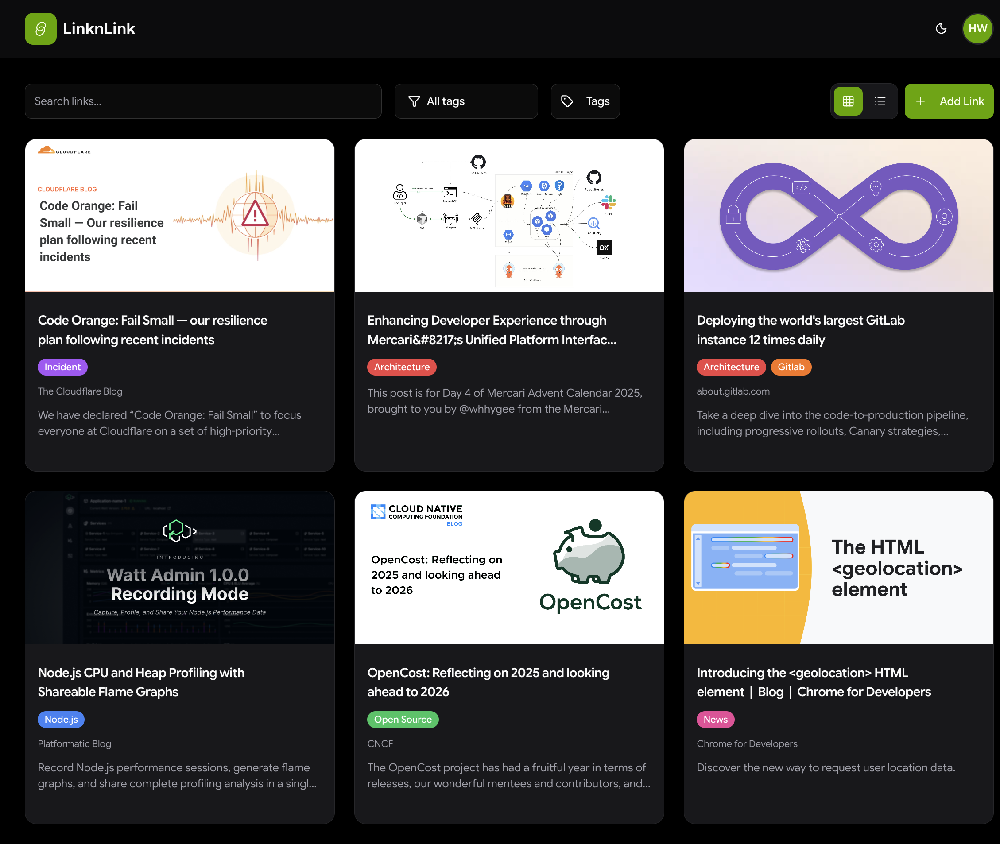
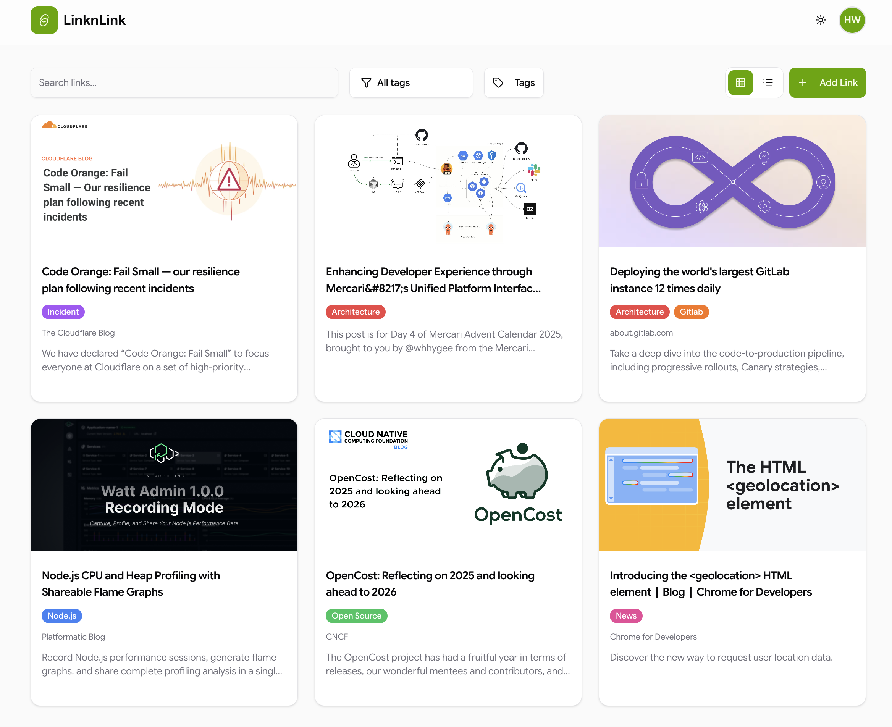
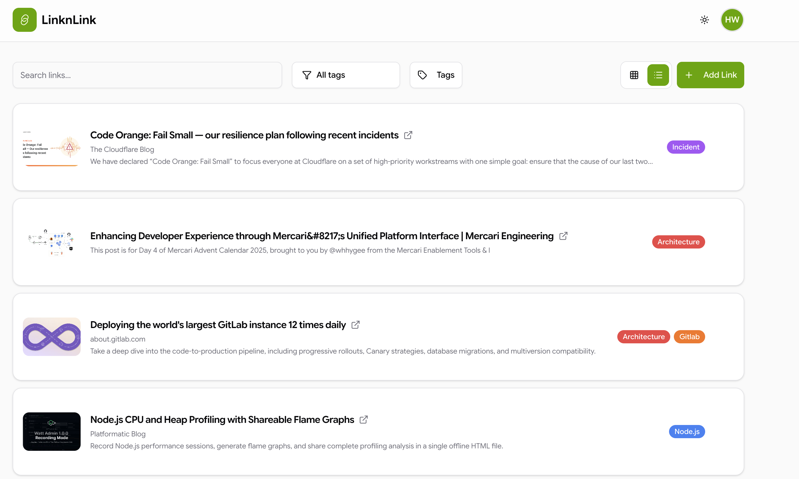
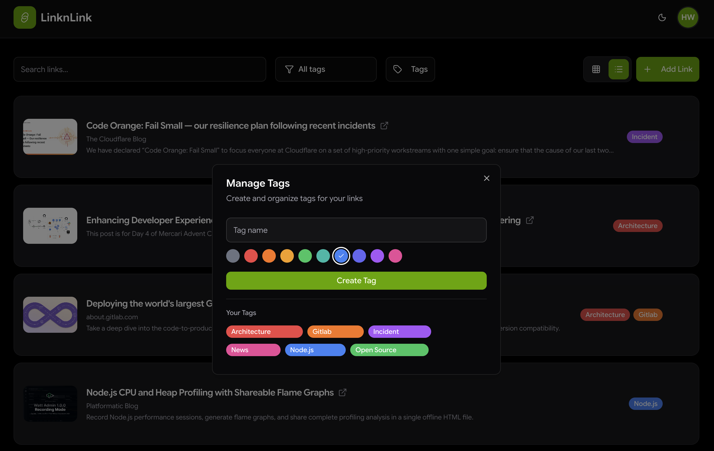

# 🔗 LinknLink

> Your modern, beautiful link management application built with Next.js and PocketBase


## 📸 Screenshots

<div align="center">
  
  
  
  
</div>

## ✨ Features

### 🎯 Core Functionality
- **📚 Bookmark Management** - Save, organize, and manage all your important links in one place
- **🏷️ Smart Tagging** - Create custom tags with colors to organize your bookmarks
- **🔍 Powerful Search** - Find links instantly with debounced search functionality
- **🎨 View Modes** - Switch between grid and list views for optimal browsing
- **📱 Responsive Design** - Beautiful UI that works seamlessly on all devices


## 🚀 Quick Start

### Prerequisites

- **Docker** and **Docker Compose** 

1. **Clone the repository**
   ```bash
   git clone https://github.com/sonmezerekrem/linknlink.git
   cd linknlink
   ```

2. **Set up environment variables**
   ```bash
   # Create .env file (optional, has defaults)
   cat > .env << EOF
   POCKETBASE_DOMAIN=http://localhost:8090
   POCKETBASE_ADMIN_EMAIL=admin@example.com
   POCKETBASE_ADMIN_PASSWORD=admin123456789
   POCKETBASE_URL=http://backend:8090
   NEXT_PUBLIC_POCKETBASE_URL=http://localhost:8090
   EOF
   ```

3. **Start the application**
   ```bash
   docker-compose up -d
   ```

4. **Access the application**
   - Frontend: [http://localhost:3001](http://localhost:3001)
   - Backend Admin: [http://localhost:8090/_](http://localhost:8090/_)


## 🗺️ Roadmap

- [ ] Export/Import bookmarks
- [ ] Browser extension
- [ ] Collections/folders
- [ ] Sharing links
- [ ] Analytics dashboard
- [ ] Mobile Apps


